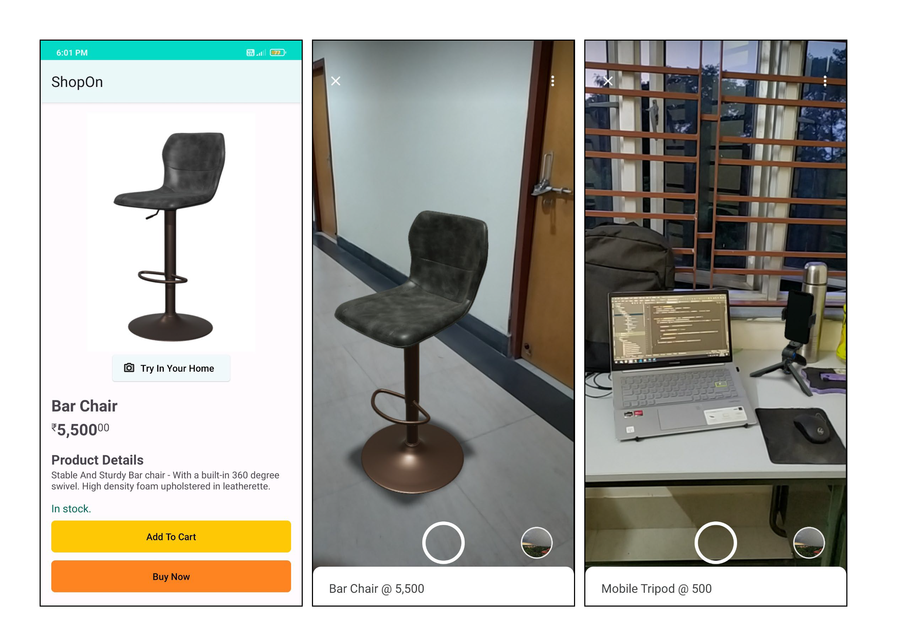

# ShopOn
This is an Android Native application developed for experiecing real life products in a augmented environment before spending so much money and actually buying it.

## Problem Statement:
What is that one thing that has refrained customers from buying online for a long time? One of the prominent differences between traditional and online shopping has been physically experiencing the products, confirming its size, all of which has been a pain point for a very long time while buying any product online. If we could solve this problem of product trials, checking the product dimensions by comparing it with real world objects, we can onboard many customers who doesn’t buy online because of this gap.

## Proposed Solution:
I intend to solve these problems by using the _Augmented Reality (AR) Technology_, through which we’ll target on providing customers with virtual representation analysing the product’s size, fitment, colour theme sync, etc. With the feature of trying out their products virtually through their mobile phones, the gap between the customer and the product will be minimized.

## Screenshots of the application :

## How does it work?
We will be using **SceneViewer** by triggering a explicit intent to it. 
Scene Viewer is an immersive viewer that enables 3D and AR experiences from our Android app. It lets users of our application easily preview, place, view, and interact with web-hosted 3D models in their environment. It uses **ARCore**, which is Google’s platform for building augmented reality experiences. Using different APIs, ARCore enables our application to sense its environment, understand the world and interact with information.

ARCore uses three key capabilities to integrate virtual content with the real world as seen through your phone's camera:
1. **Motion tracking** allows the phone to understand and track its position relative to the world.
2. **Environmental understanding** allows the phone to detect the size and location of all type of surfaces: horizontal, vertical and angled surfaces like the ground, a coffee table or walls.
3. **Light estimation** allows the phone to estimate the environment's current lighting conditions.
